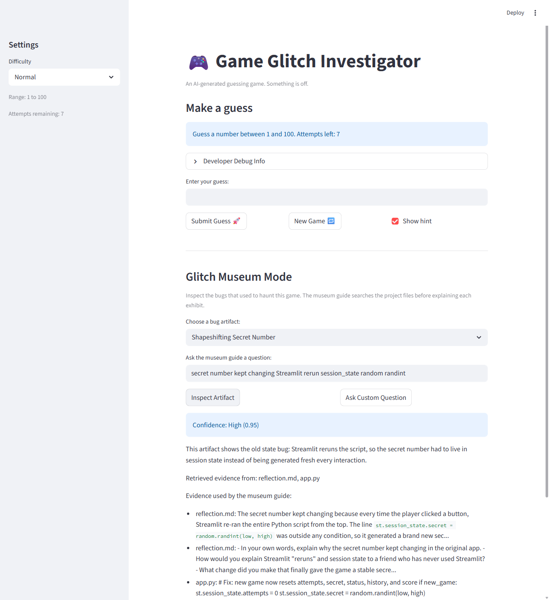
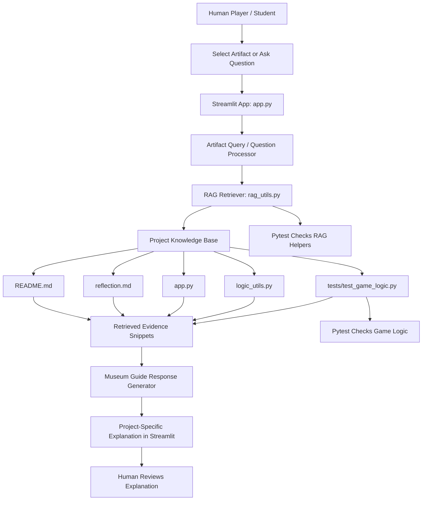

# Game Glitch Investigator: Glitch Museum Mode

## Original Project

My original Modules 1-3 project was **Game Glitch Investigator: The Impossible Guesser**, a Streamlit number guessing game that was intentionally full of AI-generated bugs. The original goal was to debug the game, fix broken state management and game logic, refactor reusable functions into `logic_utils.py`, and prove the fixes with `pytest`. By the end of that project, the game could generate a stable secret number, validate guesses by difficulty, give correct higher/lower hints, reset properly, and score the player consistently.

## Title and Summary

**Glitch Museum Mode** turns the finished guessing game into an interactive debugging exhibit. Instead of only playing the fixed game, users can inspect old bug "artifacts" such as the shapeshifting secret number, backwards hints, broken reset button, invalid guesses, strange scoring, and the tests that caught those issues.

This matters because it shows how AI-generated code should be reviewed: not just by asking whether it runs, but by checking whether it behaves correctly. The added RAG system helps explain the debugging process using real evidence from the project files, so the app becomes both a playable game and a learning tool.



## Architecture Overview

Glitch Museum Mode is integrated directly into the main Streamlit app. The user selects a museum artifact or asks a custom question, the app sends that query to the local RAG helper in `rag_utils.py`, and the retriever searches the project knowledge base for relevant evidence. The museum guide then creates a project-specific explanation using the retrieved snippets.



The human is involved by reviewing whether the generated explanation makes sense. Testing is involved through `pytest`, which checks both the original game logic and the new RAG helper functions.

## Setup Instructions

1. Clone or download the project.
2. Open a terminal in the project folder.
3. Install dependencies:

```bash
pip install -r requirements.txt
```

4. Run the Streamlit app:

```bash
python -m streamlit run app.py
```

5. Open the local Streamlit URL shown in the terminal.
6. Play the guessing game or scroll to **Glitch Museum Mode**.
7. Select a bug artifact, click **Inspect Artifact**, or type your own question and click **Ask Custom Question**.

To run the tests:

```bash
pytest
```

## Sample Interactions

### Example 1: Shapeshifting Secret Number

**Input:** Select `Shapeshifting Secret Number` and click **Inspect Artifact**.

**Output:** The museum guide explains that Streamlit reruns the script after interactions, so the secret number needed to be stored in `st.session_state` instead of being regenerated every time. It retrieves evidence from files like `reflection.md` and `app.py`.

### Example 2: Backwards Hint Machine

**Input:** Ask: `Which test proves the hints were fixed?`

**Output:** The guide explains that low guesses should tell the player to go higher and high guesses should tell the player to go lower. It cites evidence from `tests/test_game_logic.py`, including tests such as `test_hint_too_low_tells_player_to_go_higher` and `test_hint_too_high_tells_player_to_go_lower`.

### Example 3: Suspicious Scorekeeper

**Input:** Select `Suspicious Scorekeeper` and click **Inspect Artifact**.

**Output:** The guide explains that the old scoring logic gave strange bonuses for wrong guesses, while the fixed `update_score` function now deducts points consistently for wrong guesses and awards win points based on the number of attempts used. It retrieves evidence from `logic_utils.py` and the score-related tests.

## Design Decisions

- I used a lightweight local RAG system instead of a paid AI API so the project is easy to run from GitHub without secrets or account setup.
- I kept the retriever in `rag_utils.py` so the RAG logic is separate from the Streamlit UI and can be tested directly.
- I used project files as the knowledge base because the assignment is about explaining this specific debugging process, not answering general programming questions.
- I used keyword scoring and text chunks as a simple retrieval method. This is less powerful than embeddings, but it is transparent, fast, and enough for a small project.
- I made the museum guide template-based instead of fully generative. The trade-off is that responses are less flexible, but they are reliable, evidence-based, and easier to test.
- I kept the original guessing game playable while adding the museum as an educational layer below it.

## Testing Summary

The project uses `pytest` to check both the fixed game logic and the RAG helper logic.

The game tests verify that:

- Winning guesses are detected correctly.
- Higher/lower hints point in the correct direction.
- Negative and out-of-range guesses are rejected.
- New games reset status, score, attempts, and history.
- Difficulty changes reset the secret number into the new range.
- Scoring rewards wins and consistently deducts points for wrong guesses.

The RAG tests verify that:

- Museum artifacts map to useful retrieval queries.
- Relevant chunks are retrieved for matching questions.
- Empty or unrelated questions return a graceful "not enough evidence" answer.
- Generated museum answers include retrieved project evidence.
- Confidence scores are based on retrieved evidence strength and never exceed `1.0`.

The current reliability result is: **26 out of 26 automated tests passed**. The RAG guide now reports a confidence score from `0.00` to `1.00`; unrelated questions receive `0.00` confidence and the fallback response instead of an unsupported answer.

One issue I ran into was making the RAG feature testable without launching the full Streamlit app. I solved that by separating retrieval and answer generation into `rag_utils.py`, then testing those functions directly.

## Portfolio Artifact

- **GitHub Repository:** [https://github.com/AvocadoGG1/applied-ai-system-GGI](https://github.com/AvocadoGG1/applied-ai-system-GGI)
- **Loom Video Walkthrough:** `PASTE_LOOM_VIDEO_LINK_HERE`
- **Presentation Guide:** See `PRESENTATION.md` for the 5-7 minute walkthrough plan.

This project shows that I am becoming an AI engineer who cares about more than getting a demo to run. I can take an AI-generated system, find where it fails, add tests, improve the user experience, and build a RAG feature that explains its answers with evidence. It also shows that I think about reliability and responsibility: the system includes confidence scoring, fallback behavior, and human-readable evidence instead of pretending every answer is equally trustworthy.

## Responsible AI Reflection

This system has important limitations. The RAG retriever uses keyword matching, so it can miss useful evidence if the user phrases a question in an unexpected way. It is also biased toward the files included in the knowledge base, which means it can only explain the bugs and fixes that are documented in this project. The confidence score measures retrieval strength, not absolute truth, so a high score means "I found strong matching evidence," not "this answer is guaranteed correct."

The system could be misused if someone treated the museum guide as a general programming expert or copied its explanations without checking the evidence. To prevent that, the guide shows retrieved case-file snippets, gives low confidence when evidence is weak, and returns a "not enough evidence" message for unrelated questions. I would also keep the knowledge base limited to approved project files so it does not accidentally expose private information.

What surprised me most while testing reliability was how useful failure cases were. The unrelated-question test proved that the AI should sometimes refuse to answer instead of stretching weak context into a confident explanation. Adding confidence scoring also showed me that reliability is not just about passing tests; it is about helping the user understand when the system has enough evidence and when it does not.

I collaborated with AI throughout the project as a debugging and design partner. One helpful suggestion was to move the game logic into `logic_utils.py`, which made it much easier to test functions like `check_guess`, `parse_guess`, and `update_score` without launching Streamlit. One flawed suggestion was an early partial validation fix that rejected negative numbers but did not reject guesses outside the selected difficulty range; testing and manual review exposed that gap, and I had to add full range validation.

## Reflection

This project taught me that AI-generated code can look convincing while still having serious logic problems. The original game ran, but the hints were backwards, the secret number changed unexpectedly, invalid guesses were accepted, and the reset button did not fully reset the game.

Adding Glitch Museum Mode helped me see RAG as more than just "search and print." The retrieved evidence actually changes the answer because the guide explains bugs using the project's real code, tests, and reflection notes. I also learned that testing is part of responsible AI development: a helpful AI system should not only produce answers, but also give users ways to check whether those answers are grounded and reliable.
