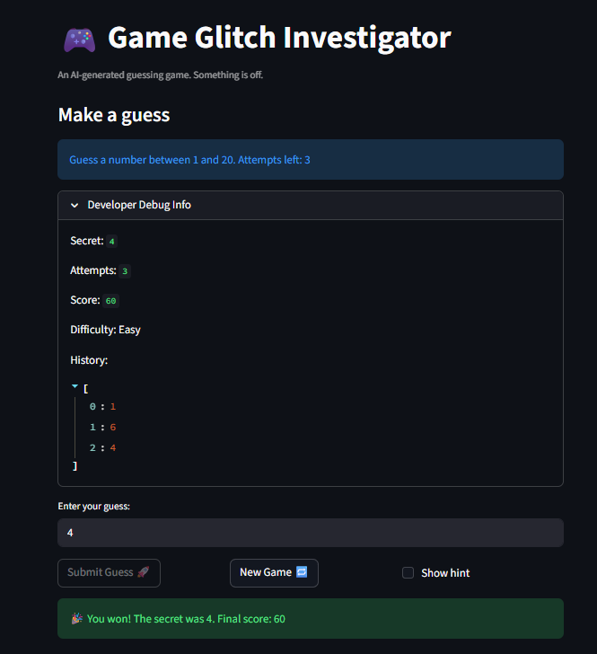

# 🎮 Game Glitch Investigator: The Impossible Guesser

## 🚨 The Situation

You asked an AI to build a simple "Number Guessing Game" using Streamlit.
It wrote the code, ran away, and now the game is unplayable. 

- You can't win.
- The hints lie to you.
- The secret number seems to have commitment issues.

## 🛠️ Setup

1. Install dependencies: `pip install -r requirements.txt`
2. Run the broken app: `python -m streamlit run app.py`

## 🕵️‍♂️ Your Mission

1. **Play the game.** Open the "Developer Debug Info" tab in the app to see the secret number. Try to win.
2. **Find the State Bug.** Why does the secret number change every time you click "Submit"? Ask ChatGPT: *"How do I keep a variable from resetting in Streamlit when I click a button?"*
3. **Fix the Logic.** The hints ("Higher/Lower") are wrong. Fix them.
4. **Refactor & Test.** - Move the logic into `logic_utils.py`.
   - Run `pytest` in your terminal.
   - Keep fixing until all tests pass!

## 📝 Document Your Experience

- [x] **Game Purpose:** The player tries to guess a secret number within a limited number of attempts. The difficulty setting controls the range of the number and how many attempts are allowed. Points are awarded based on how few guesses it takes to win.

- [x] **Bugs Found:**
  1. The hints were backwards — guessing too low told the player to go lower, and guessing too high told the player to go higher.
  2. The New Game button did not reset status, score, or history — a finished game stayed locked and old scores carried over.
  3. The secret number was generated using a hardcoded range of 1–100 regardless of difficulty, so Easy and Hard secrets could be completely outside their intended ranges.
  4. Negative numbers and out-of-range guesses were accepted as valid inputs.
  5. The sidebar showed a static attempt limit that never counted down during play.
  6. Changing difficulty mid-game kept the old secret, which could be unguessable in the new range.
  7. The `attempts % 2 == 0` glitch converted the secret to a string, causing alphabetical comparison bugs that flipped hints (e.g. `"4" > "22"` evaluated `True`).
  8. The debug panel and history were always one guess behind because they rendered before the submit block executed.
  9. The Submit Guess button remained clickable after the game was won or lost.
  10. Clicking the Show Hint checkbox after winning re-triggered the balloons animation.
  11. The score logic awarded bonus points for wrong guesses on even-numbered attempts, which made no sense.

- [x] **Fixes Applied:**
  1. Swapped the hint messages in `check_guess` so "Too Low" says "Go HIGHER!" and "Too High" says "Go LOWER!".
  2. Added `status`, `score`, `history`, `last_hint`, and `balloons_shown` resets to the New Game block.
  3. Updated all secret generation to use `get_range_for_difficulty(difficulty)` instead of hardcoded `1–100`.
  4. Added range and negative number validation to `parse_guess`, which now accepts `low` and `high` parameters.
  5. Updated the sidebar to compute remaining attempts dynamically from `session_state.attempts`.
  6. Added a difficulty-change detection block that resets all game state when the player switches difficulty.
  7. Removed the `attempts % 2 == 0` string conversion so `check_guess` always compares integers.
  8. Stored hints in `session_state.last_hint` and called `st.rerun()` after every valid guess so the debug panel always shows fresh state.
  9. Disabled the Submit Guess button using `disabled=` when `status != "playing"`.
  10. Added a `balloons_shown` flag so the win animation only fires once per game.
  11. Rewrote `update_score` to award `max(10, 100 - 10 * attempts)` for a win and deduct 5 points equally for any wrong guess.

## 📸 Demo

- 

## 🚀 Stretch Features

- [ ] [If you choose to complete Challenge 4, insert a screenshot of your Enhanced Game UI here]
